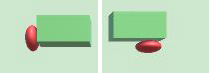

## Overview
In this project, I would use the knowledge of Particle System, Springy Structures and Rigid Body Collision in this course to build a 3D Breakout Game. In this game, the ball could bounce around bricks and the sliding paddle. Player could use keyboard to control the paddle to move left and right to catch the ball while its falling and bounce it up. A brick could be destroyed when collide with the ball. Some visual effects using springy structures and particles could be applied on the ball and bricks.

## Goals
1. In the basic part of this game, all the objects, including walls, the bouncing ball, the paddle, and the bricks are rigid bodies. The ball is a sphere and the bricks is cuboids. The ball is the only object that affected by gravity.
2. Springy structures could be applied on the bouncing ball, so that it will looks like a jelly ball. When colliding with other objects it will be squeezed and regain its shape after reflecting.

3. When a bricks is destroyed, particles couble be used to simulate the crashed or explosion effects. The brick could break into some small fragments, and each fragment is represented by a particle.
4. The bricks could also be other shapes, like sphere, cylinder or pyramid.
5. More springy or particle effects could be applied if time is sufficient.

## Reference
1. [Professor House's course website](https://people.cs.clemson.edu/~dhouse/courses/817/)
2. [Unity tutorial: Creating a Breakout Game](https://unity3d.com/cn/learn/tutorials/modules/beginner/live-training-archive/creating-a-breakout-game)

